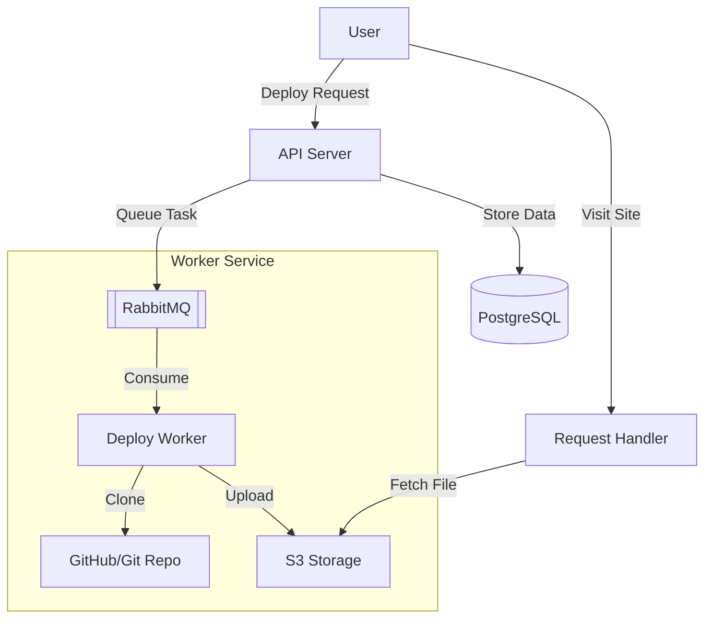

# Gopher Vercel

A simplified clone of the Vercel deployment platform, built with Go. This platform allows users to deploy static websites from Git repositories with a single API call.

## Architecture



## detailed Flow

1.  **Deployment Request**: Authenticated user submits a Github `repo_url` to the API.
2.  **Queuing**: API creates a pending deployment and pushes a task to RabbitMQ.
3.  **Processing**: Support worker consumes the task:
    -   Clones the repository using `go-git`.
    -   Uploads source files to S3.
    -   Builds the project (`npm install` & `npm run build`).
    -   Uploads built artifacts (`dist/`) to S3.
4.  **Serving**: User visits `http://<deploy-id>.domain.com`.
    -   `request-handler` service intercepts the request.
    -   Determines `deploy-id` from the subdomain.
    -   Fetches and streams the content from S3.

## Components

-   **API Server (`cmd/api`)**: Handles user authentication (JWT), deployment requests, and status checks.
-   **Worker Service**: Runs within the API (currently) to process background deployment tasks.
-   **Request Handler (`cmd/request-handler`)**: A lightweight service dedicated to serving the deployed static sites.
-   **PostgreSQL**: Stores user data and deployment metadata.
-   **RabbitMQ**: Message broker for asynchronous task processing.
-   **S3 (MinIO/R2/AWS)**: Object storage for source code and build artifacts.

## Getting Started

### Prerequisites

-   Go 1.21+
-   Docker & Docker Compose
-   Node.js & NPM (for building projects)

### Setup

1.  **Clone the repository**:
    ```bash
    git clone https://github.com/yourusername/gopher-vercel.git
    cd gopher-vercel
    ```

2.  **Start Infrastructure**:
    ```bash
    docker compose up -d postgres rabbitmq
    ```

3.  **Run API Server**:
    ```bash
    make run
    ```

4.  **Run Request Handler**:
    ```bash
    make run-handler
    ```
