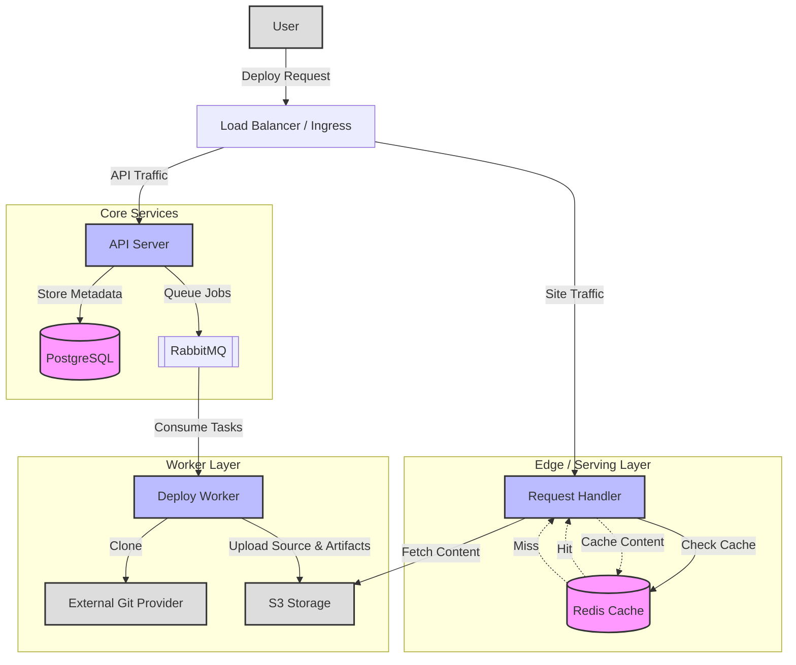

# Gopher Vercel

A simplified clone of the Vercel deployment platform, built with Go. This platform allows users to deploy static websites from Git repositories with a single API call.

## Architecture



## Component Description

-   **API Server (`cmd/api`)**: Handles user authentication (JWT), deployment requests, and status checks.
-   **Request Handler (`cmd/request-handler`)**: Serves deployed sites with **Redis caching** and S3 fallback.
-   **Worker Service**: Processes background deployment tasks (Clone, Build, Upload).
-   **PostgreSQL**: Stores user data and deployment metadata.
-   **RabbitMQ**: Message broker for asynchronous task processing.
-   **Redis**: High-performance key-value store for caching static assets.
-   **S3 (MinIO/R2/AWS)**: Object storage for source code and build artifacts.

## Getting Started

### Prerequisites

-   Go 1.21+
-   Docker & Docker Compose
-   Node.js & NPM (for building projects)

### Setup

1.  **Clone the repository**:
    ```bash
    git clone https://github.com/yourusername/gopher-vercel.git
    cd gopher-vercel
    ```

2.  **Start Infrastructure**:
    ```bash
    docker compose up -d postgres rabbitmq
    ```

3.  **Run API Server**:
    ```bash
    make run
    ```

4.  **Run Request Handler**:
    ```bash
    make run-handler
    ```
